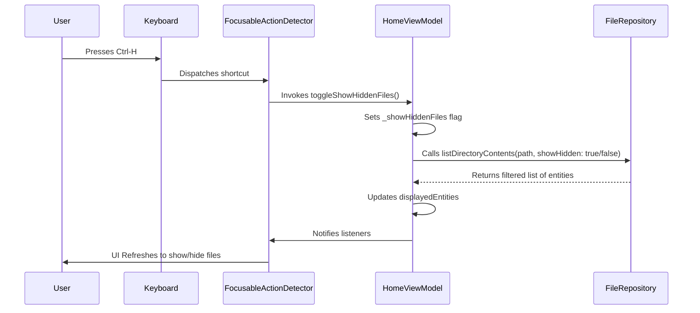

# Modification Design Document: Home Navigation and Hidden File Toggle

## 1. Overview

This document outlines the design for modifying the "Find" file explorer application to introduce two key features:
1.  A "Home" button in the sidebar to navigate directly to the user's home directory.
2.  The ability to toggle the visibility of hidden files (those starting with a `.`) using a `Ctrl-H` keyboard shortcut.

## 2. Detailed Analysis of the Goal or Problem

The application currently lacks a direct way to return to the home directory and does not provide an option to view hidden files, which is a common requirement for file explorers.

### Functional Requirements:

-   **Home Navigation**: The "Home" button in the `Sidebar` must trigger a reload of the file view to show the contents of the user's home directory.
-   **Hidden File Toggling**:
    -   By default, files and folders starting with a `.` should be hidden from the file list.
    -   Pressing `Ctrl-H` should toggle the visibility of these hidden files.
    -   When visibility is toggled, the current directory view must refresh to show or hide the files accordingly.
-   **State Management**: The state of whether to show hidden files must be managed centrally so that it persists during navigation.

### Technical Challenges:

-   **Keyboard Input**: The application needs to listen for global keyboard shortcuts. This requires careful handling of focus to ensure the key events are captured correctly.
-   **State Integration**: The new `showHiddenFiles` state needs to be integrated into the existing `HomeViewModel` and passed down to the `FileRepository` to perform the filtering.
-   **UI Feedback**: The UI should provide some form of feedback when hidden files are shown or hidden, although this is a secondary concern for the initial implementation.

## 3. Alternatives Considered

### 3.1 Keyboard Shortcut Handling

-   **`RawKeyboardListener`**: This is a low-level widget for listening to raw hardware keyboard events. While it provides maximum control, it requires manual interpretation of key codes and modifiers, which can be complex and less portable.
-   **`FocusableActionDetector` with `Shortcuts` and `Actions`**: This is Flutter's modern, high-level API for handling keyboard shortcuts and actions. It's more declarative, integrates well with the focus system, and is the recommended approach for desktop applications.

-   **Decision**: `FocusableActionDetector` is the preferred choice for its robustness and alignment with modern Flutter desktop development practices.

### 3.2 State Management for Hidden Files

-   **Local State in `HomeScreen`**: The `showHiddenFiles` flag could be managed as local state within the `HomeScreen` widget. This is simpler for a single screen but makes it harder to persist the state if the user navigates to other parts of the app (e.g., a future settings screen).
-   **State in `HomeViewModel`**: Managing the state in the `HomeViewModel` is the correct approach under the MVVM architecture. It centralizes the UI state, makes it accessible to all child widgets, and ensures that the state is preserved during navigation within the home view.

-   **Decision**: The `showHiddenFiles` state will be managed within the `HomeViewModel`.

## 4. Detailed Design for the Modification

### 4.1 `file_repository.dart`

The `listDirectoryContents` method will be updated to accept a named boolean parameter `showHidden`.

```dart
// Before
Future<List<FileSystemEntity>> listDirectoryContents(String path) async { ... }

// After
Future<List<FileSystemEntity>> listDirectoryContents(String path, {bool showHidden = false}) async {
  // ...
  await for (final entity in directory.list()) {
    final name = entity.path.split('/').last;
    if (!showHidden && name.startsWith('.')) {
      continue; // Skip hidden files
    }
    // ... rest of the loop
  }
  // ...
}
```

### 4.2 `home_view_model.dart`

The `HomeViewModel` will be updated to manage the `showHiddenFiles` state.

```dart
class HomeViewModel extends ChangeNotifier {
  // ... existing code

  bool _showHiddenFiles = false;
  bool get showHiddenFiles => _showHiddenFiles;

  // ... existing code

  Future<void> _loadDirectoryContents(String path) async {
    // ...
    try {
      _displayedEntities = await _fileRepository.listDirectoryContents(path, showHidden: _showHiddenFiles);
      _currentPath = path;
    } 
    // ...
  }

  void toggleShowHiddenFiles() {
    _showHiddenFiles = !_showHiddenFiles;
    _loadDirectoryContents(_currentPath); // Reload with the new setting
  }

  Future<void> navigateToHomeDirectory() async {
    final homePath = await _fileRepository.getHomeDirectory();
    await _loadDirectoryContents(homePath);
  }

  // ... existing code
}
```

### 4.3 `sidebar.dart`

The `onTap` callback for the "Home" `_SidebarItem` will be implemented.

```dart
// In the build method of Sidebar
_SidebarItem(
  icon: Ionicons.home_outline,
  label: 'Home',
  onTap: () => context.read<HomeViewModel>().navigateToHomeDirectory(),
  isSelected: true, // This will need to be dynamic later
),
```

### 4.4 `home_screen.dart`

The `HomeScreen` widget will be wrapped in a `FocusableActionDetector` to handle keyboard shortcuts.

```dart
// New shortcut and intent classes (can be in the same file or a new one)
class ToggleHiddenFilesIntent extends Intent {}

// In HomeScreen's build method
return FocusableActionDetector(
  autofocus: true,
  shortcuts: {
    LogicalKeySet(LogicalKeyboardKey.control, LogicalKeyboardKey.keyH): ToggleHiddenFilesIntent(),
  },
  actions: {
    ToggleHiddenFilesIntent: CallbackAction<ToggleHiddenFilesIntent>(
      onInvoke: (intent) => context.read<HomeViewModel>().toggleShowHiddenFiles(),
    ),
  },
  child: Scaffold(
    // ... existing Scaffold implementation
  ),
);
```

### 4.5 Sequence Diagram for `Ctrl-H`



## 5. Summary of the Design

The modification will be implemented by:
1.  Updating the `FileRepository` to filter hidden files.
2.  Adding state and methods to `HomeViewModel` for managing hidden file visibility and home navigation.
3.  Connecting the "Home" button in the `Sidebar` to the new `HomeViewModel` method.
4.  Using a `FocusableActionDetector` in `HomeScreen` to capture the `Ctrl-H` shortcut and trigger the visibility toggle.

## 6. References to Research URLs

-   **Flutter Keyboard Shortcuts**: `https://docs.flutter.dev/development/ui/advanced/keyboard`
-   **`FocusableActionDetector` Class**: `https://api.flutter.dev/flutter/widgets/FocusableActionDetector-class.html`
-   **`LogicalKeySet` Class**: `https://api.flutter.dev/flutter/services/LogicalKeySet-class.html`
