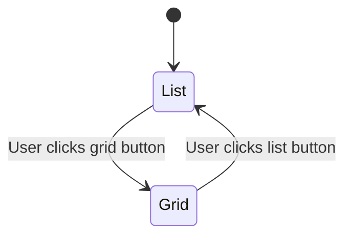

# Modification Design Document: Grid View and View Switching

## 1. Overview

This document outlines the design for modifying the "Find" file explorer to add a grid view layout for displaying files and folders. This includes implementing the logic to switch between the existing list view and the new grid view using buttons in the header bar.

## 2. Detailed Analysis of the Goal or Problem

The current implementation only offers a single list view for file and folder display. Providing an alternative grid view is a common feature in file explorers that offers users a more visual way to browse content, especially in directories with images or other media.

### Functional Requirements:

-   **Grid View**: A new grid layout must be created to display files and folders. Each item in the grid should show an icon and the file name below it.
-   **View Switching**:
    -   The `grid_outline` button in the `HeaderBar` should switch the main content area to the new `FileGridView`.
    -   The `list_outline` button in the `HeaderBar` should switch the view back to the existing `FileListView`.
-   **State Management**: The application must remember the current view type (`list` or `grid`) and visually indicate which view is active in the `HeaderBar`.
-   **Interaction Parity**: The grid view items should have the same interaction capabilities as the list view items (e.g., tap to navigate, selection).

### Technical Challenges:

-   **State Integration**: A new state property for the view type must be added to the `HomeViewModel` and used by the `HomeScreen` to render the correct view.
-   **Widget Creation**: New widgets for the grid view (`FileGridView`) and its items (`FileGridItem`) must be created.
-   **UI Logic**: The `HeaderBar` needs to be updated to reflect the current view state and to trigger state changes in the `HomeViewModel`.

## 3. Alternatives Considered

### 3.1 A Single "Omni-View" Widget

-   **Description**: A single widget could be created that takes a `viewType` parameter and internally uses a `LayoutBuilder` to switch between a `ListView` and a `GridView`.
-   **Pros**: Might reduce the number of files.
-   **Cons**: This would lead to a complex widget with a large build method containing conditional logic for both layouts. The logic for list items and grid items is also sufficiently different that it's cleaner to keep them separate.
-   **Decision**: Creating two distinct and self-contained widgets (`FileListView` and `FileGridView`) is a cleaner, more maintainable, and more scalable approach.

## 4. Detailed Design for the Modification

### 4.1 `home_view_model.dart`

An `enum` will be added to represent the view type, and the view model will be updated to manage this state.

```dart
// Add this enum, e.g., at the top of the file or in its own file
enum FileViewType { list, grid }

class HomeViewModel extends ChangeNotifier {
  // ... existing code

  FileViewType _viewType = FileViewType.list;
  FileViewType get viewType => _viewType;

  void setViewType(FileViewType type) {
    if (_viewType != type) {
      _viewType = type;
      notifyListeners();
    }
  }

  // ... existing code
}
```

### 4.2 `file_grid_item.dart` (New File)

A new widget to represent a single item in the grid.

```dart
import 'package:flutter/material.dart';
import 'package:flutter_vector_icons/flutter_vector_icons.dart';
import 'package:provider/provider.dart';

import 'package:find/src/data/models/file_system_entity.dart';
import 'package:find/src/data/models/directory_entity.dart';
import 'package:find/src/home/home_view_model.dart';

class FileGridItem extends StatelessWidget {
  const FileGridItem({super.key, required this.entity});

  final FileSystemEntity entity;

  @override
  Widget build(BuildContext context) {
    final viewModel = context.watch<HomeViewModel>();
    final isSelected = viewModel.selectedEntities.contains(entity);

    return InkWell(
      onTap: () {
        if (entity is DirectoryEntity) {
          viewModel.navigateToDirectory(entity as DirectoryEntity);
        } else {
          viewModel.toggleSelection(entity);
        }
      },
      onLongPress: () {
        viewModel.toggleSelection(entity);
      },
      child: Card(
        color: isSelected ? Theme.of(context).colorScheme.primaryContainer : Theme.of(context).colorScheme.surface,
        child: Padding(
          padding: const EdgeInsets.all(8.0),
          child: Column(
            mainAxisAlignment: MainAxisAlignment.center,
            children: [
              Icon(
                entity.isDirectory ? Ionicons.folder_outline : Ionicons.document_outline,
                size: 48,
                color: isSelected ? Theme.of(context).colorScheme.primary : Theme.of(context).colorScheme.onSurface,
              ),
              const SizedBox(height: 8),
              Text(
                entity.name,
                textAlign: TextAlign.center,
                overflow: TextOverflow.ellipsis,
                maxLines: 2,
              ),
            ],
          ),
        ),
      ),
    );
  }
}
```

### 4.3 `file_grid_view.dart` (New File)

A new widget to display the grid of file system entities.

```dart
import 'package:flutter/material.dart';
import 'package:provider/provider.dart';

import 'package:find/src/home/home_view_model.dart';
import 'package:find/src/home/widgets/file_grid_item.dart';

class FileGridView extends StatelessWidget {
  const FileGridView({super.key});

  @override
  Widget build(BuildContext context) {
    final viewModel = context.watch<HomeViewModel>();

    if (viewModel.isLoading && viewModel.displayedEntities.isEmpty) {
      return const Center(child: CircularProgressIndicator());
    }

    if (viewModel.displayedEntities.isEmpty) {
      return const Center(child: Text('This folder is empty.'));
    }

    return GridView.builder(
      padding: const EdgeInsets.all(8.0),
      gridDelegate: const SliverGridDelegateWithMaxCrossAxisExtent(
        maxCrossAxisExtent: 150,
        mainAxisSpacing: 8,
        crossAxisSpacing: 8,
      ),
      itemCount: viewModel.displayedEntities.length,
      itemBuilder: (context, index) {
        final entity = viewModel.displayedEntities[index];
        return FileGridItem(entity: entity);
      },
    );
  }
}
```

### 4.4 `header_bar.dart`

The `HeaderBar` will be updated to use the new `viewType` state to control button appearance and dispatch actions.

```dart
// In HeaderBar's build method
final viewModel = context.watch<HomeViewModel>();

// ... inside the Row
IconButton(
  icon: const Icon(Ionicons.list_outline),
  isSelected: viewModel.viewType == FileViewType.list,
  onPressed: () => viewModel.setViewType(FileViewType.list),
),
IconButton(
  icon: const Icon(Ionicons.grid_outline),
  isSelected: viewModel.viewType == FileViewType.grid,
  onPressed: () => viewModel.setViewType(FileViewType.grid),
),
```

### 4.5 `home_screen.dart`

The `HomeScreen` will conditionally render the correct view.

```dart
// In HomeScreen's build method, inside the Expanded Row child
Expanded(
  child: Consumer<HomeViewModel>(
    builder: (context, viewModel, child) {
      switch (viewModel.viewType) {
        case FileViewType.grid:
          return const FileGridView();
        case FileViewType.list:
        default:
          return const FileListView();
      }
    },
  ),
),
```

### 4.6 View Type State Diagram



## 5. Summary of the Design

The modification will be implemented by:
1.  Adding a `viewType` state to the `HomeViewModel`.
2.  Creating new `FileGridView` and `FileGridItem` widgets for the grid layout.
3.  Updating the `HeaderBar` to allow switching between `list` and `grid` view types.
4.  Conditionally rendering `FileListView` or `FileGridView` in the `HomeScreen` based on the view model's state.

## 6. References to Research URLs

-   **`GridView.builder` Class**: `https://api.flutter.dev/flutter/widgets/GridView-class.html`
-   **State Management (Provider)**: `https://docs.flutter.dev/data-and-backend/state-mgmt/simple`